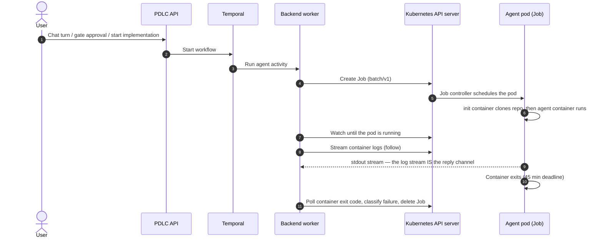
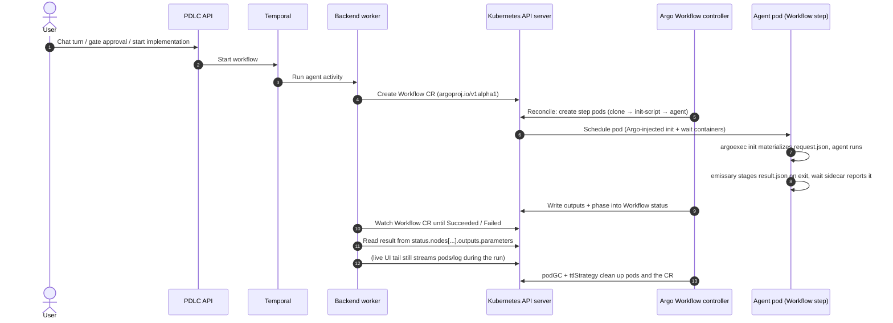
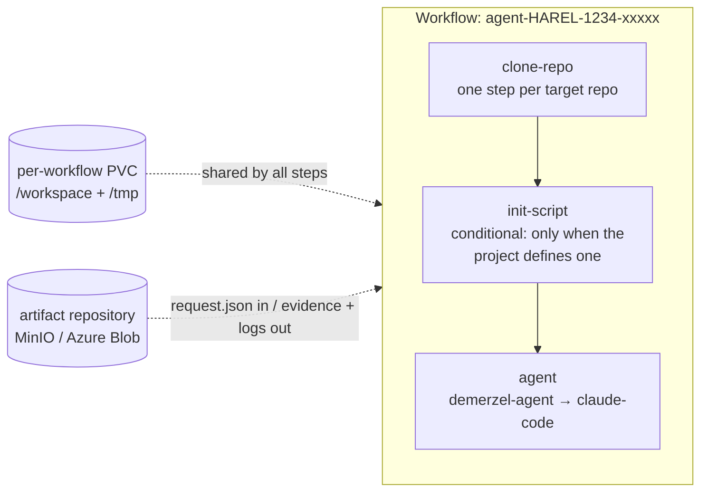

# PDLC Agent Runs on Argo Workflows — Implementation Guide (for Harel Ops)

This document specifies the migration of the PDLC factory's agent-run primitive from raw
Kubernetes `batch/v1` Jobs to **Argo Workflows**, and everything an ops/platform engineer
needs to implement it: the background, the target architecture, the request/response
contracts, diagrams, capacity, and the exact permissions.

**Scope — what changes and what does not.**

| Changes | Does NOT change |
|---|---|
| The per-run wrapper: `batch/v1 Job` → `argoproj.io Workflow` CR | Temporal remains the orchestrator (workflows, retries, timeouts, heartbeats) |
| Request transport: env-var blob → file (input artifact) | The agent container image and its entrypoint (`demerzel-agent`) |
| Reply channel: stdout sentinel lines → declared output parameter | The secrets model (API writes k8s Secrets; pods reference by name) |
| Completion detection: log-stream-end + exit-code polling → Workflow CR watch | The agent pod's security posture (non-root, no capabilities, zero k8s API access) |
| Repo clone / init script: init containers → named DAG steps | The AI gateway / model configuration |
| Worker RBAC: `batch/jobs` verbs → `workflows.argoproj.io` verbs | The API's RBAC (pods read, pods/log, secrets write) |

---

## 1. Background: how a run works today

Pods are started by **user actions in the product** (a chat turn, a gate approval, starting
implementation) — never manually. The API triggers a Temporal workflow; the backend
**worker** (an in-cluster Go process using `client-go`) creates a short-lived Kubernetes
Job per agent run — one pod per pipeline phase, ≤ 45 min lifetime
(`activeDeadlineSeconds: 2700`, deliberately under the 50-min Temporal activity timeout),
deleted 5 min after finishing (`ttlSecondsAfterFinished: 300`). Nothing is long-running.



Key properties of today's Job (all built in Go by the worker — there is no Job YAML
anywhere):

- **`backoffLimit: 0`** — Kubernetes never retries; Temporal owns retries (3 activity
  attempts).
- **Clone init container(s)** — one per target repo, running a bash script with a
  path-aware git credential helper (picks a PAT by repo owner from the `GH_PAT_TOKENS`
  JSON map, falling back to `GITHUB_TOKEN`; non-GitHub hosts use `oauth2:$GITLAB_TOKEN`).
  The repo URL is a positional argument, never shell-interpolated; tokens never appear in
  URLs or argv.
- **The request is an env var** — the whole task (`AgentRequest`: phase, prompts, repos,
  branches, model, plugins…) is JSON-marshaled, gzipped, base64-encoded into
  `DEMERZEL_AGENT_REQUEST`, and split into 96 KiB chunks (`DEMERZEL_AGENT_REQUEST_0..N`)
  when it exceeds the kernel's ~128 KiB per-env-var `exec()` ceiling.
- **The reply is stdout** — the pod has no network path back to the worker and zero
  Kubernetes API access (no ServiceAccount token is even mounted), so the agent prints
  sentinel lines (`<<<DEMERZEL_RESULT>>>{json}<<<END>>>`) on stdout, and the worker
  parses the followed log stream as the run's result.
- **Env ordering is a security control** — project-defined env vars are injected FIRST so
  that platform entries (credentials, `HOME`, the request transport, the masked
  `DEMERZEL_MCP_CONFIG` on coding phases) always win via the kubelet's last-wins
  resolution.
- **Secrets by name only** — the pod's `envFrom` references the shared agent credential
  Secret and an optional per-project Secret (`<secret>-proj-<projectID>`). The worker
  never reads secret values; the kubelet resolves them at pod start.

Both the env-var request transport and the stdout reply protocol are workarounds for the
same limitation: a bare Job has no input/output concept. Argo Workflows provides exactly
those primitives, which is the core of this migration.

## 2. Target architecture

**Temporal stays the orchestrator.** The only change in the control flow: the worker's
agent activity submits an Argo `Workflow` CR (referencing a chart-shipped
`WorkflowTemplate` named `demerzel-agent-run`) instead of creating a Job, and watches the
CR for completion instead of following the log stream.



### The run DAG

Each run is a three-step DAG on a **per-workflow PVC** (`volumeClaimTemplates` — created
with the workflow, deleted with it). The steps replace today's init containers:



Why steps instead of init containers:

- **Named failure classification.** A clone auth failure fails the `clone-repo` *node*; a
  broken project init script fails the `init-script` node. The worker reads *which* step
  failed from the Workflow status — today it has to probe init-container statuses to tell
  an auth error from a generic failure.
- **Separate logs.** Init-script output cannot pollute the agent's stdout (which carries a
  parsed protocol during migration).
- **Independent timeouts.** A hung `npm install` in an init script can be bounded at 10
  minutes without consuming the agent's 45-minute budget.

> **Note — the init script is currently dormant.** The UI defines a per-project init
> script and the worker ships it in the request, but the in-pod agent has no handler for
> it: it is silently ignored today. The `init-script` step is where this feature becomes
> real. It runs the user-authored script in the same sandbox as everything else (non-root,
> no capabilities, no cluster access, project env available), on the shared workspace.

### What's inside the agent step's pod

Identical to today's agent container — same image (Node 22 + Python + Go + git + pinned
`@anthropic-ai/claude-code`), same env precedence ladder, same `envFrom` secrets, same
read-only plugin-cache PVC mount, same security context — plus two small containers Argo
injects into every step pod:

| Container | Injected by | Purpose |
|---|---|---|
| `init` (argoexec) | Argo | Materializes input artifacts (writes `request.json`) into a staging volume before the main container starts |
| `wait` (argoexec) | Argo | Collects declared outputs after the main container exits; uploads artifacts; writes parameter values into the Workflow status |
| `main` | template | Our agent container. Its command is wrapped by Argo's **emissary** binary (PID 1 inside the container), which is how output files get read out of the container after exit |

One template requirement that differs from today: **declare `command: [demerzel-agent]`
explicitly** in the WorkflowTemplate. Emissary must know what to exec; if the command is
omitted, the controller falls back to querying the image's entrypoint from the container
registry — an extra dependency and failure mode we do not want on-prem.

## 3. The request path (worker → pod)

**File-based, always.** The request JSON arrives as an Argo **input artifact**
materialized at a fixed path; the agent reads the path from
`DEMERZEL_AGENT_REQUEST_FILE`. The env-var transport (`DEMERZEL_AGENT_REQUEST` +
gzip+base64+chunking) survives only as a migration fallback and is deleted after cutover.

Why file, not env:

- One code path — the chunk-rejoin logic, the encoding flag, and the ~128 KiB per-env-var
  `exec()` ceiling workaround all disappear.
- Env leaks into every child process — today the multi-hundred-KiB request blob is
  inherited by the claude CLI, git, and every subprocess. A file read once is not.
- Where the file comes from becomes Argo's concern, invisible to the agent.

Two artifact sources, chosen by the worker at submit time by size:

| Source | Mechanism | When |
|---|---|---|
| `raw` (inline) | Request JSON embedded in the Workflow CR; argoexec `init` writes it to the file. No network, no storage dependency. | Default. Requests up to ~256 KiB (the CR must stay well under etcd's ~1 MiB object budget) |
| Artifact repository | Worker uploads to MinIO/Azure Blob; argoexec `init` downloads it (with the repository's credentials — never the agent's). | Large requests (the epic-plan history replay), which today require env chunking |

Template sketch:

```yaml
apiVersion: argoproj.io/v1alpha1
kind: WorkflowTemplate
metadata:
  name: demerzel-agent-run
spec:
  entrypoint: run
  volumeClaimTemplates:
  - metadata: { name: workspace }
    spec:
      accessModes: [ReadWriteOnce]
      resources: { requests: { storage: 40Gi } }
  templates:
  - name: agent
    inputs:
      artifacts:
      - name: request
        path: /workspace/.demerzel/request.json
    container:
      image: "{{workflow.parameters.image}}"
      command: [demerzel-agent]            # explicit — see emissary note above
      workingDir: /workspace
      env:
      - { name: DEMERZEL_AGENT_REQUEST_FILE, value: /workspace/.demerzel/request.json }
      - { name: HOME, value: /tmp }
      - { name: SHELL, value: /bin/bash }
      envFrom:
      - secretRef:
          name: "demerzel-agent-secret-proj-{{workflow.parameters.projectId}}"
          optional: true
      - secretRef: { name: demerzel-agent-secret }   # platform secret LAST — last-wins
      volumeMounts:
      - { name: workspace, mountPath: /workspace }
```

The decoded request itself is unchanged — the same unified `AgentRequest` JSON contract
for every phase (the pod branches on `phase`). Abbreviated implement-phase example:

```json
{
  "phase": "implement",
  "featureId": "3f2a9c1e-…", "projectId": "a1b2c3d4-…",
  "workItemId": "7c8e2f10-…", "workItemKey": "HAREL-1234",
  "title": "Add retry to policy-quote fetch",
  "description": "…acceptance criteria…",
  "systemContext": "…phase system prompt…",
  "artifactContext": "…epic/feature/work-item context…",
  "repos": [
    { "name": "harel-pdlc-backend", "url": "https://…/harel-pdlc-backend.git",
      "role": "target", "targetBranch": "develop", "defaultBranch": "main" },
    { "name": "harel-pdlc-frontend", "url": "https://…/harel-pdlc-frontend.git",
      "role": "context" }
  ],
  "repoUrl": "https://…/harel-pdlc-backend.git",
  "baseBranch": "feature/policy-resilience",
  "baseAncestors": [
    { "branch": "epic/policy-purchase", "base": "develop" },
    { "branch": "feature/policy-resilience", "base": "epic/policy-purchase" }
  ],
  "model": "claude-sonnet-5", "maxTurns": 50,
  "plugins": ["go-dev@cx-marketplace"]
}
```

**Credentials are never in the request** — tokens and API keys arrive only via the
secret-backed `envFrom`.

## 4. The response path (pod → worker)

The agent writes its Reply JSON (PR ref, trace id, usage, evidence summary, findings) to a
declared path; Argo carries it into the Workflow status:

```yaml
  - name: agent
    # …container as above…
    outputs:
      parameters:
      - name: result
        valueFrom: { path: /tmp/demerzel-result.json }
      artifacts:
      - name: evidence                    # bulky payloads bypass the CR status
        path: /tmp/demerzel-evidence.json
        optional: true
```

Mechanics: emissary (PID 1 inside the agent container) copies the declared paths into the
shared `/var/run/argo` volume when `demerzel-agent` exits; the `wait` sidecar writes the
parameter value into the Workflow CR's node status and uploads artifacts to the
repository. The worker then:

1. **Watches the Workflow CR** until `status.phase` ∈ {`Succeeded`, `Failed`, `Error`} —
   replacing today's "log stream ended, now poll the container exit code" dance.
2. **Reads `status.nodes[<agent-node>].outputs.parameters[result]`** — replacing stdout
   sentinel parsing.
3. On failure, reads **which named step failed** (`clone-repo` / `init-script` / `agent`),
   its exit code, and message — the input to the existing auth-error / incomplete-run
   classification, now without pod forensics.

Size rule (mirror of the request side): the Reply is small and stays a parameter; anything
bulky (full evidence packages, transcripts) goes as an output artifact. If node statuses
ever grow large, Argo's node-status offload to Postgres (which the platform already runs)
is the escape hatch.

**What stays on the log stream.** Outputs exist only after the container exits, so two
mid-run consumers keep following `pods/log` exactly as today:

- the **live log tail** in the product UI (served by the API), and
- the worker's **per-turn usage accounting** and early PR-ref signal from claude-code's
  `stream-json` events.

The stream demotes from load-bearing reply channel to live telemetry: a truncated stream
can no longer lose the run's result.

## 5. Project environment and init script

Per-project configuration defined in the product UI reaches the pod as follows:

| Item | Today | With Argo |
|---|---|---|
| Project **secret** env | Per-project k8s Secret, `envFrom` by name, `optional: true` | Identical — the secret name parameterizes: `demerzel-agent-secret-proj-{{workflow.parameters.projectId}}` |
| Project **plain** env (stored in DB) | Injected as literal env entries, first in the list | `podSpecPatch` on the submitted Workflow (worker renders the list at submit time), **or** folded into the per-project Secret (cleanest: nothing project-defined appears in the CR) |
| Project **init script** | Shipped in the request; **never executed** (dormant feature) | Its own conditional DAG step: `bash` on the agent image, in `/workspace`, with the project env, own timeout, own log stream |

**The precedence ladder must be preserved and tested.** Today's guarantee — a project can
never clobber `HOME`, the request transport, a credential, or the coding-phase
`DEMERZEL_MCP_CONFIG` mask — relies on ordering: project sources first, platform secret
last among `envFrom` (last wins), platform entries as explicit `env` (explicit beats
`envFrom`). Restate the same ordering in the WorkflowTemplate and cover it with a
golden-file test on the rendered Workflow.

## 6. Secrets

**Secret values are never stored in the platform database and never appear in a Workflow
CR.** The flow, unchanged by this migration:

1. An operator or project admin enters a value in the UI (write-only: the UI reports key
   *presence*, never values).
2. The **API** upserts it directly into a Kubernetes Secret in the agent namespace — the
   shared credential Secret (`ANTHROPIC_API_KEY`, `GITHUB_TOKEN`, `GH_PAT_TOKENS`,
   `GITLAB_TOKEN`, `DEMERZEL_MCP_CONFIG`) or the project's Secret
   (`<secret>-proj-<projectID>`), created on first save.
3. The **worker** puts only the Secret *name* into the pod spec (`envFrom`). It has no
   secrets RBAC at all.
4. The **kubelet** resolves the Secret into env vars at pod start. Rotation is picked up
   by the next run — no restarts.

**Hard rule for the implementation:** no secret value may travel as a workflow parameter,
inside `podSpecPatch`, or anywhere else in the CR. Workflow CRs are visible in `kubectl`,
the Argo UI, and the workflow archive; Secrets are the only channel with Secret-grade
protection. The artifact repository's own credentials live in Argo's artifact-repository
configuration, consumed by the injected argoexec containers — never by the agent
container.

## 7. Permissions

All grants are **namespace-scoped Roles in the agent namespace** unless noted. The agent
identity model is unchanged: the agent pod's ServiceAccount has no RoleBindings and
`automountServiceAccountToken: false` — a compromised agent run cannot reach the
Kubernetes API at all.

| Component | Resources & verbs | Why | Delta vs today |
|---|---|---|---|
| Backend worker | `workflows.argoproj.io/workflows`: create, get, list, watch, delete · `pods`: get, list, watch · `pods/log`: get | Submit each run, watch it to completion, read outputs, stream live telemetry, clean up | **`workflows` verbs are new; `batch/jobs` verbs removable after cutover** (keep only if the plugin-seed / workspace-reclaim one-shots remain Jobs — recommended initially) |
| Backend worker (release ns) | `pdlc.iguazio.com/pipelineconfigs, prompts`: get, list, watch | Reads platform config CRs on every run | unchanged |
| Backend API | `pods`: get, list · `pods/log`: get · `secrets`: get, create, update, patch, delete · config CRs: read/write (release ns) | Live log view in the UI; credential rotation and per-project environment Secrets from Settings | unchanged |
| Agent pod | **None** (no RoleBindings; API token not mounted) | Acts only through the platform's allow-listed adapters | unchanged |
| **Argo Workflow controller** | Its own chart-managed RBAC over `workflows`, `workflowtaskresults`, `pods`, etc. | Reconciles Workflow CRs into pods, records outputs | **new component** |
| argoexec (`init`/`wait`) containers | No cluster RBAC needed for our flow beyond what the controller's executor role provides (`workflowtaskresults` create); artifact-repo credentials via artifact-repository config | Materialize inputs, report outputs | **new** |

**Recommended install mode for on-prem:** namespaced installation with
**managed-namespace** mode — the controller runs in the platform namespace and manages
workflows only in the agent namespace. No cluster-wide rights anywhere, preserving
today's posture. The `argo-server` UI is optional; the product UI and `kubectl` cover
day-to-day needs.

### Verify the grants with kubectl

```bash
NS=<agent-ns>
WORKER=system:serviceaccount:<platform-ns>:<release>-worker

# Worker — must all say "yes":
kubectl auth can-i create workflows.argoproj.io -n "$NS" --as="$WORKER"
kubectl auth can-i watch  workflows.argoproj.io -n "$NS" --as="$WORKER"
kubectl auth can-i delete workflows.argoproj.io -n "$NS" --as="$WORKER"
kubectl auth can-i watch  pods                  -n "$NS" --as="$WORKER"
kubectl auth can-i get    pods/log              -n "$NS" --as="$WORKER"

# Least-privilege checks — must all say "no":
kubectl auth can-i create workflows.argoproj.io -n "$NS" \
  --as=system:serviceaccount:"$NS":<agent-sa>       # agent can't spawn runs
kubectl auth can-i get pods -n "$NS" \
  --as=system:serviceaccount:"$NS":<agent-sa>       # agent has zero API access
kubectl auth can-i create workflows.argoproj.io --all-namespaces --as="$WORKER"
kubectl auth can-i get secrets -n "$NS" --as="$WORKER"   # worker never reads secrets
```

### The kubectl equivalent of one run

Each step maps 1:1 to an RBAC verb the worker needs (everything the platform does can be
reproduced with kubectl):

```bash
NS=<agent-ns>

# 1. Launch the run                       → verb: create workflows
kubectl create -f agent-workflow.yaml -n "$NS"

# 2. Watch it to completion               → verbs: get, watch workflows
kubectl get wf -n "$NS" <wf-name> --watch

# 3. Read the run's result                → (same watch/get — it's in the CR status)
kubectl get wf -n "$NS" <wf-name> \
  -o jsonpath='{.status.nodes.*.outputs.parameters[?(@.name=="result")].value}'

# 4. Live logs during the run             → verb: get pods/log
kubectl logs -f -n "$NS" -l workflows.argoproj.io/workflow=<wf-name> -c main

# 5. Clean up                             → verb: delete workflows
kubectl delete wf <wf-name> -n "$NS"     # ttlStrategy is the backstop
```

## 8. New cluster components & capacity

### Agent pod sizing (from the capacity plan — now enforced by the WorkflowTemplate)

Per-pod sizing is unchanged from
[`agent-pod-capacity.md`](https://github.com/McK-Private/harel-pdlc-infra/blob/develop/docs/agent-pod-capacity.md);
what changes is that the WorkflowTemplate finally **sets** these values (today's Job
builder sets none, so agent pods run BestEffort). Parameterize the template by phase:

| Profile | CPU req / limit | Memory req / limit | Ephemeral storage req / limit | Used by |
|---|---|---|---|---|
| **A — Chat/planning** (no builds, no browser) | 1 / 2 | 2Gi / 4Gi | 5Gi / 10Gi | chat phases (define / structure / plan / …) |
| **B — Factory** (full build + app under test + Playwright e2e) | **4 / 8** | **8Gi / 16Gi** | **20Gi / 40Gi** | coding phases (implement / fix-pr / verify) |

Profile B reflects what runs concurrently in one pod: Claude Code, frontend + backend
builds, the app under test (Postgres, Temporal, API, worker, mocks), and headless
Chromium. The `clone-repo` and `init-script` steps are short-lived and light — size them
at Profile A regardless of phase.

### How many pods to plan for

- One active epic drives **~3–5 factory pods at peak** (work items build in parallel)
  plus **2–3 chat pods** — and PDLC is multi-user, so epics run concurrently.
- **Planning baseline: 3 concurrent epics ≈ 12–15 factory pods at peak**; revise with
  adoption. With Argo, each factory pod carries the two small argoexec containers, and
  each *running* workflow also holds a workspace PVC.
- **Node pool:** dedicated autoscaling pool, e.g. `Standard_D8s_v5` (8 vCPU / 32 GiB,
  ~2 factory pods per node), min 1 / **max 8** for the 3-epic baseline,
  **OS disk ≥ 256 GiB** (ephemeral pod storage + image cache). Scale the max with the
  target working set.
- **Image:** ~3 GB (Node + Go + Python + Chromium) in in-region ACR — pre-pull on the
  node pool, together with the (small) argoexec image.

### The migration adds:

| Component | Footprint | Notes |
|---|---|---|
| argo-workflows controller | ~0.5 CPU / 512 Mi | One Deployment; scale is not a concern at PDLC volumes (tens of concurrent workflows) |
| argoexec `init` + `wait` per pod | ~0.1 CPU / 64 Mi each | Small argoexec image; pre-pull alongside the agent image |
| Artifact repository (MinIO or Azure Blob) | ~50–100 Gi to start | Requests in, evidence + archived logs out; also removes the "256 KiB in-memory log tail is the only record" limitation |
| Per-workflow workspace PVC | 20–40 Gi × concurrent runs | `volumeClaimTemplates`; created and deleted with each workflow. Now **load-bearing** (steps share the workspace through it) |

Implementation notes:

- **Set `resources` in the WorkflowTemplate.** Today's Job builder sets none — agent pods
  run BestEffort and the documented capacity profiles are aspirational. The template is
  the natural place to finally enforce them (parameterize by phase: chat vs factory
  profile).
- Map today's lifecycle settings 1:1: `activeDeadlineSeconds: 2700` (workflow-level),
  `ttlStrategy.secondsAfterCompletion: 300`, `podGC.strategy: OnWorkflowCompletion`,
  `retryStrategy` **absent** (Temporal owns retries — the equivalent of
  `backoffLimit: 0`).
- Egress from the agent namespace is unchanged (AI gateway, GitHub/GitLab, npm/Go/pypi
  registries) **plus** the artifact repository endpoint if it lives outside the cluster.

### Protecting the platform from starvation

Agent pods are big and bursty (Profile B requests half a node); the platform's own
services — the **frontend**, the **backend API**, the **worker**, Temporal, Postgres —
are small, latency-sensitive, and must never compete with them. Today nothing prevents
that competition (agent pods are BestEffort with no placement constraints, so the
scheduler may pack them beside platform pods and the kubelet evicts BestEffort *and*
burstable neighbors under pressure). The migration is the moment to close this, in four
layers — the first two are the ones that matter most:

1. **Hard placement separation (primary defense).** Taint the agent node pool
   (`dedicated=agent:NoSchedule`) and give the WorkflowTemplate the matching
   `nodeSelector` + toleration. Platform deployments carry neither, so agent pods
   *cannot* land on the platform's nodes and platform pods cannot land on the agent
   pool. Starvation across pools becomes impossible regardless of load — the failure
   mode degrades to "agent runs queue," never "the UI is down."

2. **Admission ceiling on concurrent runs (the planned platform-side cap, implemented
   by Argo).** The capacity doc plans a ceiling on concurrent runs; Argo provides it
   without new code:
   - controller `parallelism` — global cap on running workflows;
   - a **synchronization semaphore** in the WorkflowTemplate (backed by a ConfigMap
     key, e.g. `factory-runs: 12`) — workflows beyond the cap wait as `Pending`, visibly
     queued in the CR status, instead of overcommitting the pool.
   Size the semaphore to the node pool: max 8 × D8s_v5 ≈ 16 factory pods; a cap of
   12–14 leaves headroom for chat pods and node-level daemons. Temporal's activity
   queue in front of it (`MaxConcurrentActivityExecutionSize` on the agent task queue)
   remains the first throttle, so queued work waits in Temporal with heartbeats, not as
   a pile of Pending CRs.

3. **Requests/limits + priority.** With the template enforcing the profile table above,
   agent pods become Burstable with honest requests — the scheduler can no longer
   overpack them. Additionally give agent pods a low `priorityClass`
   (e.g. `agent-run: 100`) and platform deployments a higher one
   (`platform: 10000`): if pressure ever does occur (misconfiguration, node loss), the
   kubelet and scheduler evict/preempt agent runs first — an evicted agent run is a
   retried Temporal activity, an evicted API pod is an outage.

4. **PriorityClass-scoped `ResourceQuota` as the backstop.** A quota with a
   `scopeSelector` on the agent priority class caps *agent pods specifically* at the
   pool's capacity — regardless of which namespace they share with what:

   ```yaml
   apiVersion: v1
   kind: ResourceQuota
   metadata: { name: agent-runs }
   spec:
     hard: { requests.cpu: "56", requests.memory: 120Gi, persistentvolumeclaims: "20" }
     scopeSelector:
       matchExpressions:
       - { scopeName: PriorityClass, operator: In, values: [agent-run] }
   ```

   If every other layer is misconfigured, quota admission still refuses the pod that
   would exceed the pool — surfacing as a named, classifiable step failure in the
   Workflow rather than cluster-wide pressure. (For this to be airtight, make
   `priorityClassName: agent-run` mandatory in the WorkflowTemplate — the quota then
   counts every agent pod by construction.)

Also size the **platform workloads** explicitly: frontend, API, worker, and the Argo
controller are all sub-CPU services — ~2 vCPU / 4 Gi of requests covers the set — but
they must *have* requests and the higher priority class, or the guarantees above don't
attach to them.

### Single-namespace deployment

If Harel prefers agents and platform in **one shared namespace** (likely, given the
existing on-prem setup), the design above holds with almost no changes, because the
load-bearing isolation is **node-level and priority-level, not namespace-level**:

| Mechanism | Namespace-dependent? | In a shared namespace |
|---|---|---|
| Node-pool taint + toleration/`nodeSelector` (layer 1) | No | Works unchanged — placement separation is by *node pool*, and platform pods (no toleration) still cannot land on agent nodes |
| Argo semaphore / parallelism ceiling (layer 2) | No | Works unchanged (the semaphore ConfigMap just lives in the shared namespace) |
| Requests/limits + PriorityClass (layer 3) | No | Works unchanged — this is per-pod |
| Scoped ResourceQuota (layer 4) | **Solved above** | The PriorityClass scope is exactly the "which pods does this quota count" selector that namespaces used to provide |
| Argo controller install | No | Managed-namespace mode pointing at the shared namespace |

Two consequences to accept knowingly in the shared-namespace variant:

- **The API's Secrets grant widens in effect.** Its Role (`secrets`: get/create/update/
  patch/delete, not resourceName-scoped because per-project names are dynamic) was
  justified by "the agent namespace holds only agent resources." In a shared namespace
  that grant now reaches platform Secrets too (DB credentials, etc.). Mitigations, in
  order of preference: keep platform Secrets in a *different* namespace even if the
  workloads share one; or move the per-project Secrets to a fixed prefix and accept the
  wider grant with audit logging on secret access.
- **`pods` / `pods/log` reads span platform pods.** The worker's and API's pod-read
  RBAC now also covers platform pods and their logs. Low risk (both are platform
  components already), but the worker's pod *watch* should filter by the
  `workflows.argoproj.io/workflow` label to avoid reconciling on platform pod events.

What you give up versus split namespaces is only defense-in-depth granularity — the
starvation guarantees themselves are identical. If even the two caveats above are
unacceptable, the middle ground is: shared namespace for workloads, separate namespace
for platform Secrets.

## 9. Migration plan

The runner sits behind an existing factory (`DEMERZEL_AGENT_TYPE` selects
`claude-code-pod` / `local` / mocks), which gives a clean rollout seam:

**Phase 0 — infrastructure (no behavior change).**
Install the Argo controller (namespaced, managed-namespace mode) + artifact repository;
ship the `demerzel-agent-run` WorkflowTemplate in the Helm chart; add the worker's
`workflows` RBAC alongside the existing `jobs` RBAC. Add a golden-file test asserting the
rendered Workflow CR (env ordering, secret refs, no secret values in the CR).

**Phase 1 — dual-stack.**
Agent image: read `DEMERZEL_AGENT_REQUEST_FILE` when set (fall back to the env transport);
write the result file *and* keep emitting stdout sentinels. Backend: add a
`claude-code-argo` runner implementing submit-and-watch. One image, both runners.
Flip one environment at a time via the factory flag. **Rollback = flip the flag back** —
no image or chart rollback needed.

**Phase 2 — cutover and cleanup.**
Default to the Argo runner. Delete the env-chunk encoder/decoder, the sentinel parser,
and the pod-forensics completion path; drop the worker's `batch/jobs` RBAC once the
plugin-seed and workspace-reclaim one-shots are converted (or keep it if they stay Jobs).
Wire the init-script step and the (previously unwired) workspace PVC as part of this
phase.

**Acceptance checks (per environment):**

1. An implement run completes end-to-end; the Reply arrives via output parameter and the
   PR opens as draft — byte-compatible with the Job runner's result.
2. Live log tail in the UI works mid-run.
3. A deliberately broken repo token fails the `clone-repo` step and surfaces as a
   *blocked* (auth) classification, not a timeout.
4. A deliberately failing init script fails its own step with its own log.
5. `kubectl auth can-i` matrix above passes, including all the "no"s.
6. Kill the worker mid-run; on Temporal's activity retry, the run is re-attached or
   re-submitted without orphaned pods (verify `podGC`/`ttlStrategy` reap everything).
